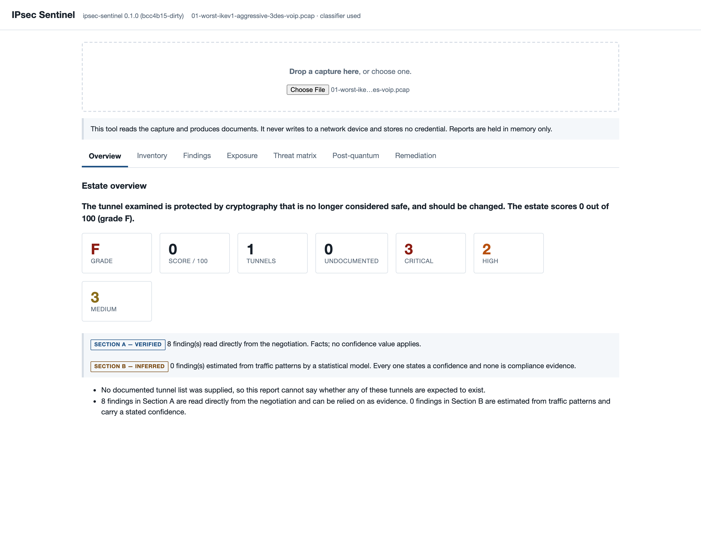

# IPsec Sentinel

**Passive IPsec protocol analysis and security assessment.** Point it at a packet
capture; get back a graded, cited assessment of every VPN tunnel in it, and a
ready-to-review configuration change for the ones that are weak.

Built for Smart India Hackathon 2026, problem statement 160.

**New here? Start with the [walkthrough](docs/WALKTHROUGH.md)** — an end-to-end tour with
real output, from a first analysis to a change package, in about twenty minutes.

---

## The idea

Wireshark shows you an IKE exchange. It does not tell you the exchange agreed 3DES with a
1024-bit Diffie-Hellman group, that NIST disallowed that in 2023, that it is exploitable
via Logjam, or what to replace it with on your specific gateway. That gap — between
*visible* and *judged* — is the whole product.

One design decision explains the rest:

> **Facts are parsed. Estimates are inferred.**

Anything read from cleartext IKE is deterministic and carries no confidence. Anything
derived from encrypted ESP is a model output and carries a calibrated one. They land in
separate sections of the report, and a validator refuses to build a report that mixes
them. An auditor reads Section A; an engineer prioritising forty tunnels reads Section B.

---

## What it does

- **Parses** IKEv1 and IKEv2 from pcap, including NAT-T on UDP 4500, and correlates
  negotiations with the ESP flows they protect.
- **Assesses** every tunnel against [26 deterministic rules](docs/RULES.md), each citing
  the standard it applies, under any of six published
  [baselines](docs/COMPLIANCE_BASELINES.md) — NIST SP 800-77 Rev. 1, CNSA 1.0,
  BSI TR-02102-3, RFC 8221/8247, ITSAR and CERT-In.
- **Grades** the estate and each tunnel, with the weighting reasoning written down in
  [SCORING.md](docs/SCORING.md).
- **Inventories** tunnels against a documented list and reports the ones nobody
  documented.
- **Cross-checks the capture against what a gateway actually has installed**, by reading
  `ip xfrm state` or `swanctl --list-sas` output the operator hands over. This closes the
  rekey blind spot — see below.
- **Infers** what a tunnel carries from encrypted flow shape alone, with a calibrated
  confidence, SHAP explanations, and an abstention when the signal is thin.
- **Grades post-quantum readiness** against RFC 9370 and RFC 8784.
- **Generates** both-ends configuration for six platforms, sequenced so a proposal change
  costs zero packet loss, with a blast-radius assessment and a suggested maintenance
  window drawn from the observed traffic profile.
- **Verifies** a remediation from a follow-up capture and closes the finding only when the
  fix is actually on the wire.
- **Watches** an interface and alerts on drift, measured against each tunnel's own past.
- **Exports** HTML, PDF, versioned JSON, and CEF/LEEF/syslog for a SIEM.

---

## The blind spot, and why it matters

A capture tells you what a tunnel **negotiated**. It cannot tell you what that tunnel is
running *now*, because IKE parameters are only in the clear at `IKE_SA_INIT` and
**`CREATE_CHILD_SA` is encrypted**. Every rekey after the first is invisible on the wire.

So a tunnel that established strong and later rekeyed to something weak looks strong
forever to anyone reading only packets. That is a property of the protocol, not a gap in
this implementation — and it is why the tool reads more than packets:

```bash
sentinel analyse capture.pcap --device-state gw-chennai.xfrm.txt
```

In the bundled demo estate, this drops the score **from 33 to 12**: the one tunnel that
negotiated AES-256 with a 384-bit curve has 3DES and MD5 installed in the kernel right
now. A capture-only assessment signs it off as the healthy one.

The state is a **file the operator sends you**, produced by one read-only command. The
tool never connects to the gateway. That is what keeps the no-credentials claim true.

---

## What it is not

Stated up front, because the boundaries are the interesting part.

- **Not an accreditation authority.** A grade is evidence you bring to an assessment, not
  a certification. Nobody has accredited this tool.
- **Not a device manager.** It generates configuration; a person applies it.
  It **never writes** to a network device: no SSH client, no NETCONF client, no vendor
  API client, and a test walks the AST of every module to keep it that way.
- **Not a credential store.** It never authenticates to anything, so there is nothing to
  store. No flag, field, environment variable or prompt takes a secret.
- **Not a decryptor.** ESP payloads are never decrypted. Everything about protected
  traffic comes from sizes, timings and directions.
- **Not a capability scanner** — unless you ask. Passive analysis sees what tunnels
  *negotiated*, not what a gateway would *accept*. `sentinel scan` answers that, transmits
  to do it, and refuses without `--i-have-authorisation`.
- **Not a governance tool.** Key management, certificate lifecycle, change control and
  everything else an ISMS covers are out of scope.

[LIMITATIONS.md](docs/LIMITATIONS.md) is the long version, and it is worth reading before
the marketing above.

---

## Quickstart

```bash
bash scripts/install.sh --prefix /opt/ipsec-sentinel
```

```bash
export PATH="/opt/ipsec-sentinel/bin:$PATH"
```

Analyse one of the bundled demo captures:

```bash
sentinel analyse demo/pcaps/01-worst-ikev1-aggressive-3des-voip.pcap --out report.html
```

That capture grades **F**: IKEv1 aggressive mode with pre-shared keys, 3DES, and a
1024-bit MODP group, carrying what the classifier identifies as VoIP. Open `report.html`
and every finding cites the clause it comes from.

With the traffic classifier, a documented-tunnel list, and gateway state:

```bash
sentinel analyse capture.pcap \
  --baseline nist_800_77r1 \
  --known tunnels.yaml \
  --device-state states/ \
  --model models/traffic.joblib \
  --out report.html --json report.json --pdf report.pdf
```

Generate a change package for what it found:

```bash
sentinel remediate capture.pcap --vendor strongswan --out change-package/
```

Or run the whole thing as a container, with the dashboard:

```bash
docker compose up -d
```

The engine listens on `127.0.0.1:8000` and the dashboard on `127.0.0.1:8080`. Drop
captures into `./captures`.

---

## Evaluating this in five minutes

If you are assessing this project rather than deploying it, **use Docker** — no Python
version to match, no dependencies to install, identical on Windows, macOS and Linux.

```bash
git clone https://github.com/PrashamJ17/SIH_PS160.git && cd SIH_PS160
```

```bash
docker compose up -d
```

Open <http://127.0.0.1:8080> and drag any file from `demo/pcaps/` onto the page. The
image is **0.68 GB** and runs as **uid 10001**, not root.

### The three commands that make the argument

**One tunnel, graded and cited:**

```bash
sentinel analyse demo/pcaps/01-worst-ikev1-aggressive-3des-voip.pcap
```

**A tunnel nobody documented** — marked `!`, found without a credential or a scan:

```bash
sentinel inventory demo/pcaps/04-estate.pcap --known demo/tunnels.yaml
```

**The one that matters.** Assess the estate from the capture alone, then again with what
the gateway actually has installed:

```bash
sentinel analyse demo/pcaps/04-estate.pcap --known demo/tunnels.yaml
```

```bash
sentinel analyse demo/pcaps/04-estate.pcap --known demo/tunnels.yaml --device-state demo/state/gw-chennai.xfrm.txt
```

The estate drops from **33/100 to 12/100**. The tunnel that *negotiated* AES-256 has 3DES
and MD5 installed right now — and a capture-only assessment signs it off as the healthy
one. That gap is the reason this project reads more than packets.

### Checking the claims rather than believing them

**"Air-gapped" — with networking switched off entirely:**

```bash
docker run --rm --network none -v "$PWD/demo:/data:ro" ipsec-sentinel:latest analyse /data/pcaps/04-estate.pcap --known /data/tunnels.yaml
```

**"It never writes to a device, and stores no credential"** — an AST sweep over every
module, run as a test rather than asserted in a README. The test class names are the
claims:

```bash
pytest tests/unit/test_security.py -vv
```

**The full suite** — 2,618 tests, lint and `mypy --strict`, in about 40 seconds:

```bash
make verify
```

### Two honest notes

The bundled captures are **real** — strongSwan pairs negotiating in the project's Docker
testbed, carrying generated traffic. `demo/build_estate.py` states exactly what was
rewritten to turn three single-tunnel captures into one estate, and what was not.

`demo/state/gw-chennai.xfrm.txt` is sample `ip xfrm state` output, standing in for what a
gateway operator would send you. It is a text file, so it works on any host — but the
command that produces it is Linux-only.

---

## Commands

| Command | What it does | Transmits? |
|---|---|---|
| `sentinel analyse` | Assess a capture, write HTML / JSON / PDF | No |
| `sentinel inventory` | List tunnels, flag undocumented ones | No |
| `sentinel remediate` | Generate a sequenced change package | No |
| `sentinel watch` | Follow an interface, alert on drift | No |
| `sentinel scan` | Enumerate what a gateway *accepts* | **Yes** |
| `sentinel model` | Train and evaluate the classifier | No |
| `sentinel dataset` | Build, package and audit the dataset | No |
| `sentinel version` | Print the build identity | No |

`scan` is the only command that puts a packet on the wire, and the refusal without
authorisation is enforced in the library rather than only in the CLI.

---

## The dashboard



Upload a capture, get the estate grade, drill into any tunnel, and see the SHAP
explanation behind an inference. It is served under a Content Security Policy with no
`unsafe-inline` at all — the stylesheet and script were split out of the HTML specifically
so the policy could forbid inline execution rather than permit it.

A recorded run is in [`demo/IPsec-Sentinel-demo.mp4`](demo/IPsec-Sentinel-demo.mp4), built
from real command output rather than a scripted screen recording.

---

## How good is the inference, really

| Split | Accuracy | Macro-F1 | What it measures |
|---|---|---|---|
| Held-out captures | 99.2% | 0.993 | In-distribution performance |
| **Held-out configurations** | **95.5%** | **0.956** | **Crypto settings never seen — closest to deployment** |
| Held-out DH groups | 96.7% | 0.966 | Did it learn traffic shape or a key-exchange artifact? |

The middle row is the one that matters, and it is the lowest. The full analysis, including
what degrades and why, is in [GENERALISATION.md](docs/GENERALISATION.md);
[CONFOUND_AUDIT.md](docs/CONFOUND_AUDIT.md) covers whether the model learned the cipher
instead of the traffic.

The model was trained on **637 rows across 7 classes** generated in a Docker testbed —
laboratory data, not production traffic, and [DATASET.md](docs/DATASET.md) says what that
costs. **Nothing in this project demonstrates that the classifier works on real enterprise
traffic, because no such traffic was available.** Deterministic findings do not depend on
it: an analysis with no model produces a complete Section A and an empty Section B.

---

## Security posture of the tool itself

- **No credential is stored, transmitted or read** — checked by AST sweeps over every
  module, not by grep.
- **No code path writes to a network device** — no remote-access client is importable, and
  a test lists the ones it refuses.
- **Passive mode opens no outbound socket** — analysis and reporting run with `socket`,
  `create_connection` and `getaddrinfo` replaced by functions that raise, and complete.
  Exactly two modules transmit at all, and a test names them.
- **`pip-audit`: 107 packages, 0 advisories.**
- **Air-gapped operation is verified**, including inside the container under
  `--network none`.

[SECURITY.md](docs/SECURITY.md) names the test behind every one of those claims, and ends
with four caveats rather than a summary.

---

## Documentation

| Document | What is in it |
|---|---|
| [WALKTHROUGH.md](docs/WALKTHROUGH.md) | **End-to-end tour with real output — start here** |
| [ARCHITECTURE.md](docs/ARCHITECTURE.md) | The two-lane design and why it exists |
| [RULES.md](docs/RULES.md) | All 26 rules with standard references — generated from the registry |
| [COMPLIANCE_BASELINES.md](docs/COMPLIANCE_BASELINES.md) | What each authority requires, and which baselines were verified against a source |
| [BASELINES.md](docs/BASELINES.md) | The baselines the ML models have to beat |
| [SCORING.md](docs/SCORING.md) | The weighting, and the reasoning behind it |
| [DATASET.md](docs/DATASET.md) | Methodology, composition and limitations |
| [GENERALISATION.md](docs/GENERALISATION.md) | Held-out results, including the unflattering ones |
| [CONFOUND_AUDIT.md](docs/CONFOUND_AUDIT.md) | Cipher-leakage analysis |
| [SECURITY.md](docs/SECURITY.md) | The tool's own posture, with the tests that check it |
| [DEPLOYMENT.md](docs/DEPLOYMENT.md) | Mirror ports, TAPs, sensor sizing, air-gapped install |
| [LIMITATIONS.md](docs/LIMITATIONS.md) | **What it cannot do** |

---

## Repository layout

| Path | What is in it |
|---|---|
| `src/ipsec_sentinel/` | The product. `parser/` reads packets, `assess/` grades them, `report/` renders, `remediate/` generates configuration |
| `tests/unit/` | The suite `make verify` runs — no Docker required |
| `tests/integration/` | Real strongSwan pairs under `netem`; needs Docker |
| `testbed/` | The Docker topology that generates the training corpus |
| `demo/` | Bundled captures, a documented-tunnel list, sample gateway state, and the recorded demo |
| `docs/` | Everything in the table above |
| `scripts/` | Dataset sweeps, document generators, milestone gates, deck and video builders |

---

## Development

```bash
make verify
```

Runs ruff, `mypy --strict` over `src`, `testbed` and `scripts`, and the full unit suite
with a coverage floor. As of the last run: **2611 passed, 2 skipped**, zero type errors
across 140 files.

The integration suite needs Docker and brings up real strongSwan pairs under `netem`:

```bash
make verify-all
```

`PROGRESS.md` is the build log: every step, what it found, and what had to be corrected.
It is worth skimming — most of the interesting bugs in this project were found by running
things, not by testing them.
